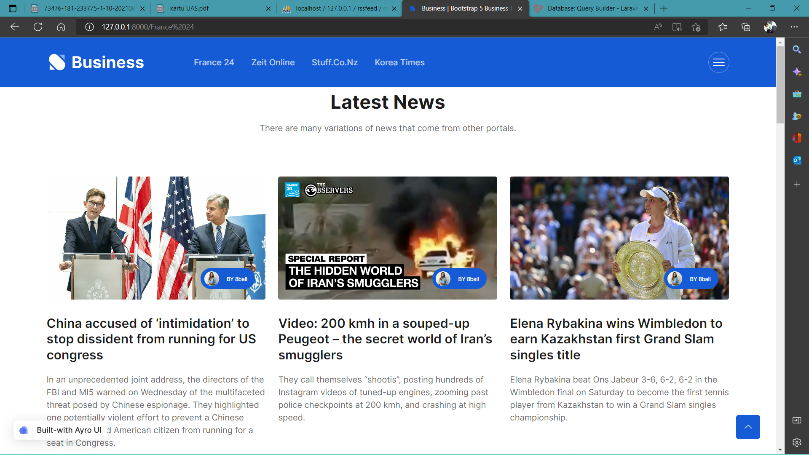
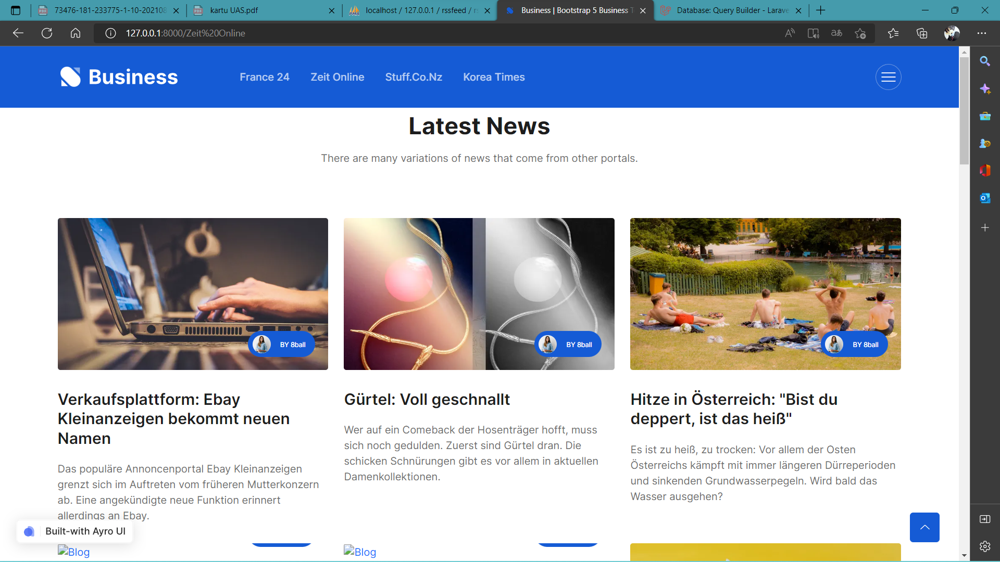
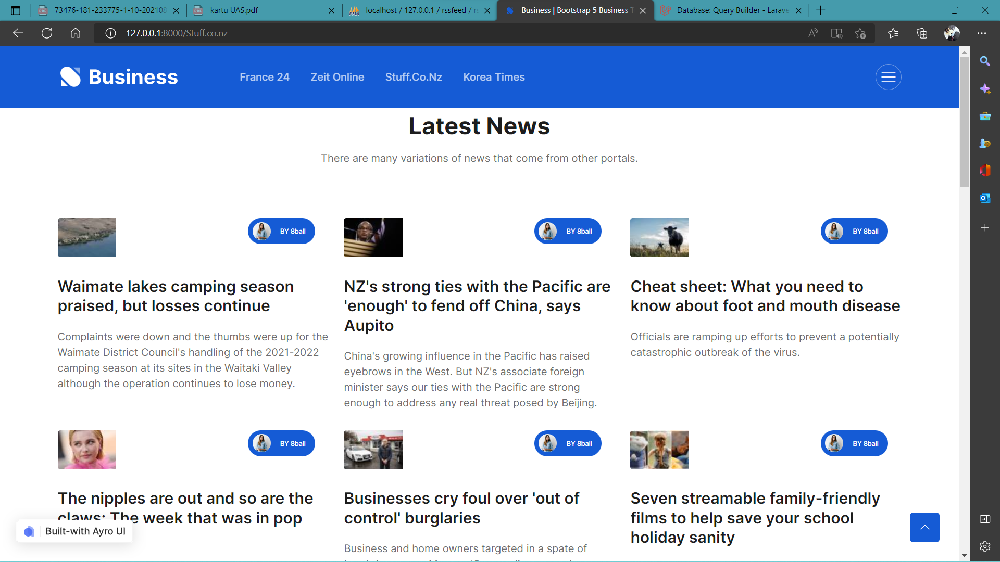
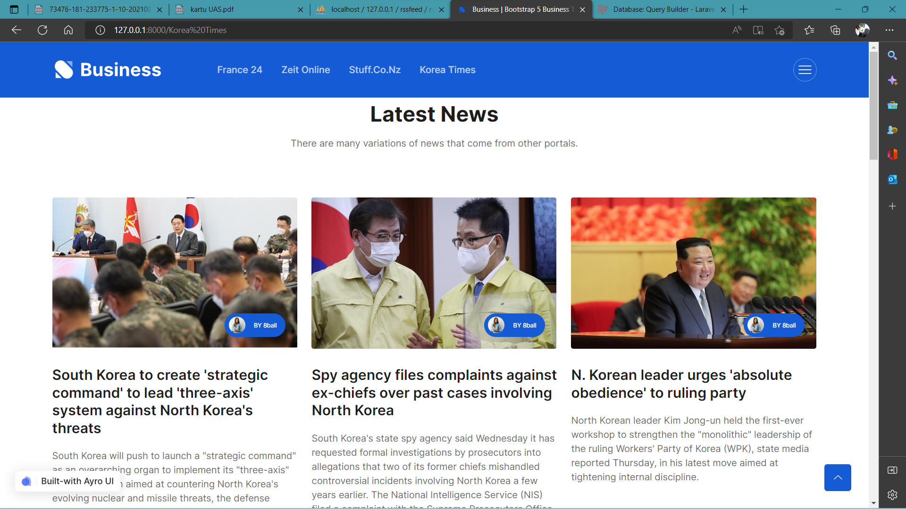

<p align="center"><a href="https://laravel.com" target="_blank"></a></p>

<p align="center">
<a href="https://travis-ci.org/laravel/framework"></a>
<a href="https://packagist.org/packages/laravel/framework"></a>
<a href="https://packagist.org/packages/laravel/framework"></a>
<a href="https://packagist.org/packages/laravel/framework"></a>
</p>

## News-Aggregator
Projek akhir / Tugas Akhir dari Mata Kuliah Pemrograman Integratif

**Mohammad Iqbal  1202218021 [ IT 02-01 ]**

------

<h2> Tahap Awal Penginstalan Laravel </h2>
  <p> - Sebelum melakukan instalasi Laravel pada Windows, pastikan sudah menginstall beberapa aplikasi pendukung proses instalasi Laravel, yaitu:<br>
	*Aplikasi XAMPP (instalasi PHP sudah ter include disini)<br>
   *Composer 
  </p>
 <p> - Selanjutnya masuk ke command prompt (cara mudah klik Win+R, ketik kata "cmd") </p> 
  <p> - Kemudian arahkan Command Prompt atau terminal menuju direktori file server. Lokasi file server pada XAMPP secara default berada pada direktori xampp/htdocs. akan         tetapi pada kasus saya direktori xampp saya berada di D:\Programs\xampp\htdocs. Masukan perintah berikut ini pada jendela Command Prompt untuk masuk ke direktori         htdocs :<br>
	pertama tuliskan <code>d:</code> kemudian tuliskan <code>cd D:\Programs\xampp\htdocs</code> <= untuk kasus saya (harap sesuaikan folder xampp anda)</p> 
 <p> - Setelah direktori sudah berganti, langkah berikutnya gunakan perintah berikut ini untuk melakukan request install laravel:<br>
	 <code>composer create-project laravel/laravel:^8.0 nama_projectmu</code> <= angka 8 menunjukkan akan menginstall laravel versi 8 </p> 
  <p> - Jika sudah selesai install, kemudian cek apakah folder untuk projek laravel yang barusan dibuat apakah sudah ada (lihat pada direktori penginstalan). </p> 
<p> - Jika file/folder sudah ada, selanjutnya pada terminal/cmd gunakan perintah <code>cd (nama projek yang barusan dibuat)</code> setelah berganti direktorinya, kemudian  kita coba <i>run</i> laravelnya dengan cara tulis <code>php artisan serve</code></p> 
<p> - Jika muncul tulisan <i>Starting Laravel development server</i> pada Command Prompt atau Terminal, langkah selanjutnya adalah membuka link yang telah disediakan oleh Laravel. Secara default alamat server,yaitu 127.0.0.1:8000. copy alamat / address tersebut dan buka pada browser favorit anda. <br> Maka instalasi Laravel telah selesai dan siap digunakan..</p><hr>

<h2>Tahap kedua - melakukan fetch RSS ke program kita</h2>
<p> - pertama buatlah database baru pada mysql (atau database apapun yg anda sukai) </p>
<p> - kemudian setelah databse telah dibuat, buka file .env pada folder program kita dan edit pada line <code>DB_DATABASE=</code> tambahkan pada line tersebut nama database yang barusan dibuat</p>
<p> - selanjutnya buka terminal/cmd dan tambahkan query <code>php artisan make:migration create_rss_table</code> dan <code>php artisan make:migration create_rss_table</code> </p>
<p> - kemudian buka file migration pada folder database dan edit pada file create_rss_table & create_news_table, edit pada bagian setelah <code>Schema::create</code> tambahkan isi tabel sesuai yang diperlukan</p>
<p> - setelah selesai ditambahkan isi tabel yang diinginkan , kemudian pada terminal/cmd tulis query <code>php artisan migrate </code>, selanjutnya lihat pada database apakah sudah berhasil dibuat tabel dan isinya sesai dengan yang kita inginkan </p>
<p> - kemudian buat mode,seed & controller dengan tambahkan query pada terminal/cmd <code>php artisan make:model Rss --seed --controller</code></p>
<p> - selanjutnya edit pada file models pada folder app>Models , dan tambahkan query <code>protected &table = 'rss';</code> maksudnya disini kita akan menggunakan tabel rss </p>
<p> - kemudian buka file Rssseeder pada folder database>sedders kita tambahkan <code>use App\Models\Rss;</code> pada bagian atas dan tambahkan query <code> Rss::create([
            'name' => 'New York Times',
            'url' => "https://rss.nytimes.com/services/xml/rss/nyt/HomePage.xml"
        ]);</code> untuk mengisi tabel rss pada database kita</p>
<p> - selanjutnya pada terminal/cmd tulis <code>php artisan db:seed</code> untuk menjalankan perintah pengisian ke tabel rss pada database, selanjutnya cek apakah pada tabel sudah ada isinya atau belum</p>
<p> - kemudian pada trminal/cmd tulis <code>php artisan make:model News --controller</code>, untuk membuat model dan contoller news</p>
<p> - selanjutnya buka file models pada folder app>Models , dan tambahkan query <code>protected &table = 'rss';</code> dan <code>protected $fillable = ['title','img_url','description','source_url','rss_id'];</code> </p>
<p> - kemudian kita akan melakukan routing pada file web.php yang terletak di folder routes, tambahkan query <code>Route::get('/aggregrate/{rss_id}', [NewsController::class, 'aggregrate']);</code></p>
- selanjutnya kita akan mengedit bagian controller news, pertama tambahkan query <code>use App\Models\Rss;</code> & <code>use App\Models\News;</code> pada bagian atas, kemudian buat query sebagai berikut : 


```
public function aggregrate($id_rss)
    { 
	
        // disini kita akan membuat logic untuk get rss data by id_rss
        $rss = Rss::findOrFail($id_rss);
	
        // kita akan parsing xml to object
        $xml = file_get_contents($rss->url);
        $xmlObj = simplexml_load_string($xml);
	
        // save to table news
        foreach($xmlObj->channel->item as $xml){
            $title= $xml->title;
            $desc= $xml->description;
            $url= $xml->enclosure['url'];
            $data= array(
                'title' => $title,
                'img_url' => null,
                'description' => $desc,
                'source_url' => $url,
                'rss_id' => $id_rss
            );
            News::Create($data);
        }

        // get from news
        $news= News::where('rss_id', $id_rss)->get();
        foreach($news as $n){
            print_r($n->title ."<br>".$n->description);
            print_r("<br><br><br><br>");    
        }
    }
```

<p> - selanjutnya pada terminal/cmd tuliskan query <code>php artisan serve</code>, kemudian buka link yang tertera di cmd pada browser favorit anda dan lihat hasilnya </p>
<p> - percobaan fetch rss ke database telah selesai</p>

------
## Tahap ketiga - menampilkan hasil fetch rss news

disini kita menggunakan 4 RSS, yaitu :

France 24 (News dari Prancis): https://esportv.org/rss/category/valorant](https://www.france24.com/en/rss

Zeit Online (News dari Jerman) : http://newsfeed.zeit.de/index

Stuff.co.nz (News dari New Zealand) : https://www.stuff.co.nz/rss

Korea TImes (News dari Korea) : https://www.koreatimes.co.kr/www/rss/northkorea.xml

- langkah awal kita membuat file blade.php di recources/views, untuk tampilannya bisa kita ambil dari templete web secara gratis yang ada di dunia maya.

   ```
   frnace.blade.php
   index.blade.php
   ```
- kemudian menambahkan Route di web.php dengan sytax seperti berikut

```
Route::get('/France 24', [App\Http\Controllers\RssController::class, 'france']);
Route::get('/ZEIT ONLINE', [App\Http\Controllers\RssController::class, 'germany']);
Route::get('/Stuff.co.nz', [App\Http\Controllers\RssController::class, 'newzeland']);
Route::get('/Korea Times', [App\Http\Controllers\RssController::class, 'korea']);
```

- selanjutnya menambahkan beberapa code baru di RssController

   ```
   
    public function france()
    {
        $index = DB::table('rss')->get();
        $index2 = DB::table('news')-> where ('rss_id','1')-> limit (15)->orderBy('id', 'DESC')->get();
        return view('france', ['index'=>$index,'index2'=>$index2]);
    }
    public function germany()
    {
        $index = DB::table('rss')->get();
        $index2 = DB::table('news')-> where ('rss_id','2')-> limit (15)->orderBy('id', 'DESC')->get();
        return view('france', ['index'=>$index,'index2'=>$index2]);
    }
    public function newzeland()
    {
        $index = DB::table('rss')->get();
        $index2 = DB::table('news')-> where ('rss_id','3')-> limit (15)->orderBy('id', 'DESC')->get();
        return view('france', ['index'=>$index,'index2'=>$index2]);
    }
     public function korea()
    {
        $index = DB::table('rss')->get();
        $index2 = DB::table('news')-> where ('rss_id','4')-> limit (15)->orderBy('id', 'DESC')->get();
        return view('france', ['index'=>$index,'index2'=>$index2]);
    }
   ```

- selanjutnya kita tampilkan hasil rss kita yang sudah kita coding tampilannya dengan memanggil alamat sesuai dengan route yang sudah dibuat, hasil tampilan bisa dilihat pada gambar berikut :

    
   
    
     


- setelah berhasil menampilkan bentuk xml dari rss kedalam html biasa, kita bisa juga menambahkan berbagai bentuk rss lain dari berbagai portal berita yang meyediakan rss mereka dan kita tampilkan di web yang kita buat dengan mudah, dengan cara ini web kita sudah dapat menampilkan berbagai macam berita dari berbagai macam portal dikumpulkan dalam satu tempat.  untuk tampilan juga bisa kita edit sesuka hati.. 
------
